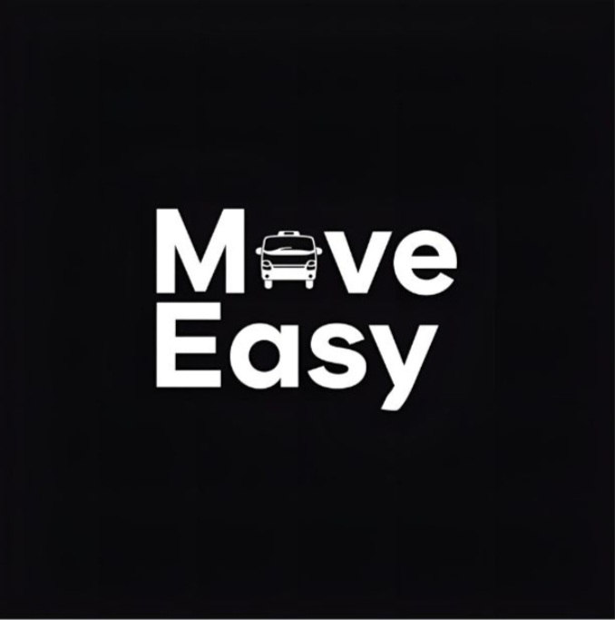

<!DOCTYPE html>
<html lang="de">
<head>
    <meta charset="UTF-8">
    <title>Move Easy</title>
    <meta name="viewport" content="width=device-width, initial-scale=1.0">

   

    
</head>
<body>

<header>
    
    <h1>< Move Easy </h1>
    
Unsere Lösung vereinfacht Prozesse, spart Zeit und schafft echten Mehrwert.

    <!-- Calendly Popup Button -->
    <a class="cta-btn"
       href="#"
       onclick="Calendly.initPopupWidget({url: 'https://calendly.com/deinname/erstgespraech'}); return false;">
        Termin vereinbaren
    </a>
</header>

<nav>
    <a href="#idee">Geschäftsidee</a>
    <a href="#vorteile">Vorteile</a>
    <a href="#video">Pitch-Video</a>
    <a href="#calendly">Kontakt</a>
</nav>

<section id="idee">
    <h2>Unsere Geschäftsidee</h2>
    

        Unsere Startup-Idee adressiert ein konkretes Problem im Markt. Viele Nutzer
        kämpfen mit ineffizienten Abläufen und fehlender Transparenz. Genau hier
        setzt unsere digitale Lösung an.
    

    

        <strong>Vision:</strong> Eine benutzerfreundliche Plattform, die Abläufe
        vereinfacht und nachhaltige Entscheidungen ermöglicht.
    

</section>

<section id="vorteile">
    <h2>Vorteile auf einen Blick</h2>
    

        

            <h3>Für Nutzer</h3>
            <ul>
                <li>Einfache Bedienung</li>
                <li>Zeit- und Kostenersparnis</li>
                <li>Hohe Transparenz</li>
            </ul>
        

        

            <h3>Für Stakeholder</h3>
            <ul>
                <li>Skalierbares Geschäftsmodell</li>
                <li>Klares Nutzenversprechen</li>
                <li>Marktpotenzial</li>
            </ul>
        

    

</section>

<section id="video">
    <h2>MVP Pitch-Video</h2>
    
Das folgende Video stellt unsere Idee, das Problem und die Lösung kompakt vor.

    <iframe src="https://www.youtube.com/embed/VIDEO_ID_HIER" allowfullscreen></iframe>
</section>

<section id="calendly">
    <h2>Termin buchen</h2>
    

        Vereinbaren Sie direkt einen Termin mit dem Projektleiter oder Projektteam.
    

    <!-- Calendly Inline Widget -->
    

    

</section>

<footer>
    
&copy; 2026 – Startup Name ·
        <a href="mailto:kontakt@startup.de">kontakt@startup.de</a>
    

</footer>

</body>
</html>

